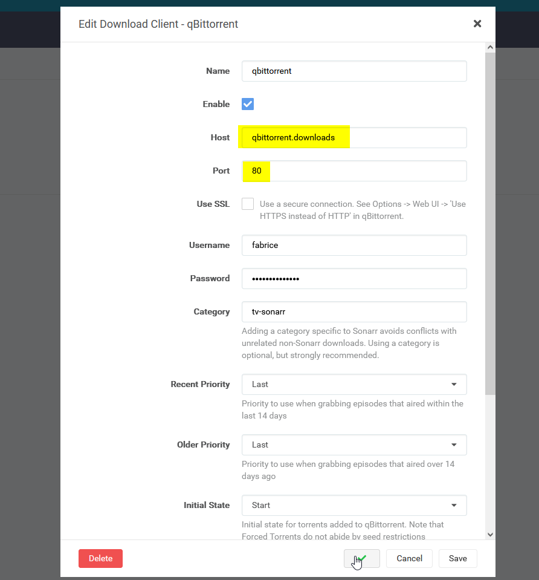
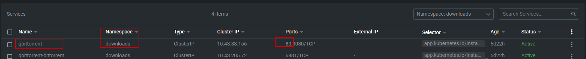

# Media notes

In this namespace there is a few deployments, that need to access resources in different [namespaces](https://kubernetes.io/docs/concepts/overview/working-with-objects/namespaces/), therefore we need to use the internal dns name format (`<service.name>.<namespace name>`) to do this.

So for example to allow Sonarr (which is in `media` ns) to access qbittorrent (which is in `downloads`), we have to call it as such:

- note the dns is `qbittorrent.downloads`
- the service exposes the port `80` (standard port for qbittorrent is `8080`, which is where 80 is redirected) as visible in the next screenshot

This should be followed in all other services that needs cross-namespace access to another.
